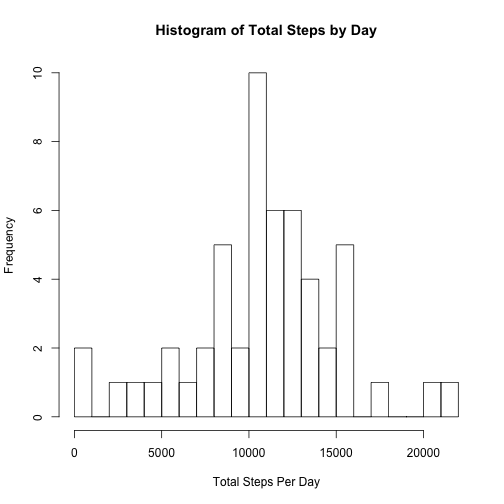
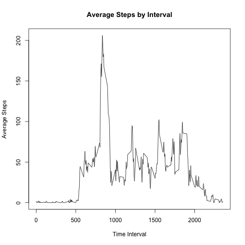
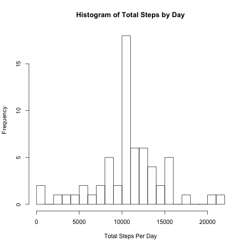
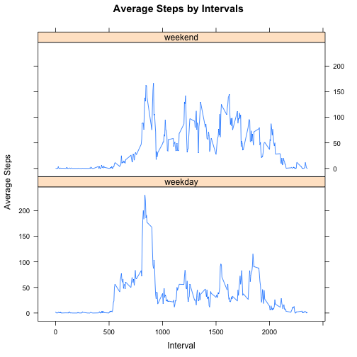

  
##Loading and preprocessing the data

```r
Data = read.csv("../data/activity.csv")
Data$date_fac = as.Date(Data$date)
Data_NARM = Data[complete.cases(Data), ]
head(Data_NARM)
```

```
##     steps       date interval   date_fac
## 289     0 2012-10-02        0 2012-10-02
## 290     0 2012-10-02        5 2012-10-02
## 291     0 2012-10-02       10 2012-10-02
## 292     0 2012-10-02       15 2012-10-02
## 293     0 2012-10-02       20 2012-10-02
## 294     0 2012-10-02       25 2012-10-02
```

##What is mean total number of steps taken per day?

```r
Data_NARM_SumByDay = aggregate(Data_NARM$steps, by = list(Data_NARM$date_fac), sum)
names(Data_NARM_SumByDay) = c("date", "steps")
hist(Data_NARM_SumByDay$steps, breaks = 20, 
     main = "Histogram of Total Steps by Day",
     xlab = "Total Steps Per Day")
```

 

```r
# mean total steps per day
mean(Data_NARM_SumByDay$steps)
```

```
## [1] 10766.19
```

```r
# median total steps per day
median(Data_NARM_SumByDay$steps)
```

```
## [1] 10765
```

##What is the average daily activity pattern?

```r
Data_NARM_AvgByInterval = aggregate(Data_NARM$steps, by = list(Data_NARM$interval), mean)
names(Data_NARM_AvgByInterval) = c("interval", "steps_avg")
plot(Data_NARM_AvgByInterval$interval, Data_NARM_AvgByInterval$steps_avg,
     main = "Average Steps by Interval", type = "l", 
     xlab = "Time Interval", ylab = "Average Steps")
```

 

```r
# The interval that contains the maximum number of steps
as.numeric(as.character(Data_NARM_AvgByInterval[which.max(Data_NARM_AvgByInterval$steps_avg), "interval"]))
```

```
## [1] 835
```

##Imputing missing values

```r
# calculate total NAs
sum(is.na(Data$steps))
```

```
## [1] 2304
```

```r
# impute missing values by average steps of the interval
Data_Impute = Data
for (i in 1:nrow(Data_Impute)) {
  if (is.na (Data_Impute$steps[i])) {
    interval_index = which (Data_NARM_AvgByInterval$interval == Data_Impute$interval[i])
    Data_Impute$steps[i] = round(Data_NARM_AvgByInterval$steps_avg[interval_index], 0)
  } else next
}
head(Data_Impute)
```

```
##   steps       date interval   date_fac
## 1     2 2012-10-01        0 2012-10-01
## 2     0 2012-10-01        5 2012-10-01
## 3     0 2012-10-01       10 2012-10-01
## 4     0 2012-10-01       15 2012-10-01
## 5     0 2012-10-01       20 2012-10-01
## 6     2 2012-10-01       25 2012-10-01
```
Make histograms and calculate average and median sum steps per day

```r
Data_Impute_SumByDay = aggregate(Data_Impute$steps, by = list(Data_Impute$date_fac), sum)
names(Data_Impute_SumByDay) = c("date", "steps")
hist(Data_Impute_SumByDay$steps, breaks = 20, 
     main = "Histogram of Total Steps by Day",
     xlab = "Total Steps Per Day")
```

 

```r
# mean total steps per day
mean(Data_Impute_SumByDay$steps)
```

```
## [1] 10765.64
```

```r
# median total steps per day
median(Data_Impute_SumByDay$steps)
```

```
## [1] 10762
```
##Are there differences in activity patterns between weekdays and weekends?

```r
# make a new variable of weekday and weekend 
Data_Impute$weekday = weekdays(as.Date(Data_Impute$date))
Data_Impute$day_level = factor (ifelse(Data_Impute$weekday %in% c("Saturday", "Sunday"), "weekend", "weekday"))
Data_Impute_AvgByInterval = aggregate(Data_Impute$steps, by = list(Data_Impute$day_level, Data_Impute$interval), mean)
names(Data_Impute_AvgByInterval) = c("day_level", "interval", "steps")
# make plots
library(lattice)
xyplot(Data_Impute_AvgByInterval$steps~Data_Impute_AvgByInterval$interval|Data_Impute_AvgByInterval$day_level, type = "l", scales = list(x = list(tick.number =4)), layout = c(1,2), xlab = "Interval", ylab = "Average Steps", main = "Average Steps by Intervals")
```

 
